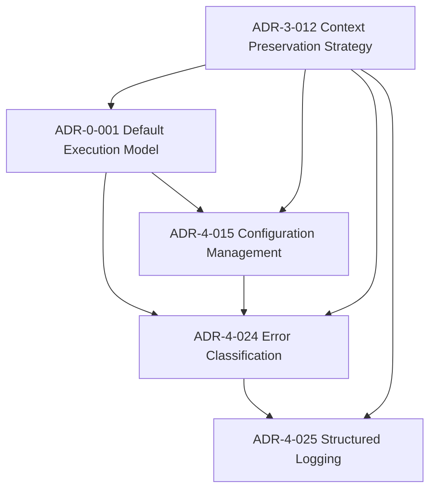

# CodeWeave ADR Framework (Public Sample)

Stop debating boilerplate architecture and build systems that let you sleep at night.

This repository contains a **public sample of the CodeWeave Architecture Decision Record framework**.

CodeWeave is an engineering doctrine designed for teams who:

- operate without dedicated platform or SRE functions
- own systems end-to-end, including on-call responsibility
- expect systems to live longer than originally planned
- value predictable behaviour under operational stress

# The CodeWeave Decision Constellation

The CodeWeave framework is not a checklist or maturity ladder.

It is a **constellation of interlocking architectural constraints** that collectively govern how systems are designed, deployed, and operated.

Each decision is intentionally small in scope, but together they form a **governance plane that prevents accidental complexity**.

[CodeWeave Full Framework](https://codeweave.lemonsqueezy.com/checkout)

The full framework currently contains **35+ Architecture Decision Records** across several engineering domains:

| Layer | Domain | Purpose |
|------|------|------|
| **0** | Structural Architecture | Execution boundaries, deployment models |
| **1** | Security Boundaries | Trust zones and authentication models |
| **2** | Operational Control | Service supervision and runtime control |
| **3** | Governance Control Plane | Preventing architectural drift |
| **4** | Engineering Standards | Logging, testing, configuration discipline |
| **5** | Incident Response | Failure handling and recovery priorities |

This repository includes a **small subset of those decisions** to demonstrate how the framework works in practice.

The full decision library is available in the **CodeWeave ADR Framework Pack**.

---


# Repository Structure

```
codeweave-adr-framework/
│
├─ README.md
├─ LICENSE.md
│
├─ adr/
│   ├─ ADR-0-001-default-execution-model.md
│   ├─ ADR-3-012-context-preservation-strategy.md
│   ├─ ADR-4-015-configuration-management.md
│   ├─ ADR-4-024-error-handling-classification.md
│   └─ ADR-4-025-structured-logging-strategy.md
│
└─ examples/
    ├─ financial-reconciliation/
    │   ├─ system-context.md
    │   └─ adr-index.md
    │
    └─ sensor-platform/
        └─ system-context.md

```
⭐ If you find this useful, consider starring the repository.
---

# Core Decisions (Public ADRs)

These decisions represent foundational engineering constraints used throughout the framework.

| ADR | Title | Status | Why it matters |
|---|---|---|---|
| [ADR-0-001](./adr/ADR-0-001-default-execution-model.md) | Default Execution Model | Accepted | Defines the single-host operational baseline |
| [ADR-3-012](./adr/ADR-3-012-context-preservation-strategy.md) | Context Preservation Strategy | Accepted | Ensures architectural reasoning is preserved |
| [ADR-4-015](./adr/ADR-4-015-configuration-management.md) | Configuration Management | Accepted | Standardises runtime configuration |
| [ADR-4-024](./adr/ADR-4-024-error-handling-classification.md) | Error Handling & Classification | Accepted | Creates predictable failure behaviour |
| [ADR-4-025](./adr/ADR-4-025-structured-logging-strategy.md) | Structured Application Logging | Accepted | Enables reliable operational diagnostics |

---

# Read by Scenario

**I want to understand how the system is deployed**

→ Read [ADR-0-001](./adr/ADR-0-001-default-execution-model.md)

---

**I want to understand how architectural reasoning is preserved**

→ Read [ADR-3-012](./adr/ADR-3-012-context-preservation-strategy.md)

---

**I want to know how runtime configuration should work**

→ Read [ADR-4-015](./adr/ADR-4-015-configuration-management.md)

---

**I want to know how failures should be classified**

→ Read [ADR-4-024](./adr/ADR-4-024-error-handling-classification.md)

---

**I want to understand logging expectations**

→ Read [ADR-4-025](./adr/ADR-4-025-structured-logging-strategy.md)

---

# Decision Map



---


# Example System Context

A couple of system context documents demonstrating how these ADRs are applied can be found here:

→ [Industrial Sensor Monitoring Platform](./examples/sensor-platform/system-context.md) 

→ [Financial Reconciliation Platform](./examples/financial-reconciliation/system-context.md)

# Example ADR Index

A sample ADR Index - showing how you can use the system of governance purposes are here:

→ [Financial Reconciliation Platform](./examples/financial-reconciliation/adr-index.md)


These examples illustrate how architectural decisions are applied in real system documentation.

---

# Why Only Five ADRs?

The full CodeWeave framework contains additional architectural and operational decision records covering topics such as:

- deployment strategy
- observability
- service decomposition
- incident response
- infrastructure ownership
- scaling models

This repository intentionally publishes only a limited subset of those decisions.

The goal is to demonstrate the structure and philosophy of the framework without publishing the full engineering doctrine.


[def]: ./examples/financial-recondsystem-context.md

# Stop Re-Litigating the Same Architecture Debates

If a decision is challenged, the **burden of proof lies with the alternative**.

Re-litigation without new information is an **operational cost**.

The full CodeWeave ADR framework contains **35+ battle-tested decisions** used to constrain architectural complexity and keep systems operationally legible.

➡️ Get the full framework  
https://codeweave.lemonsqueezy.com/checkout